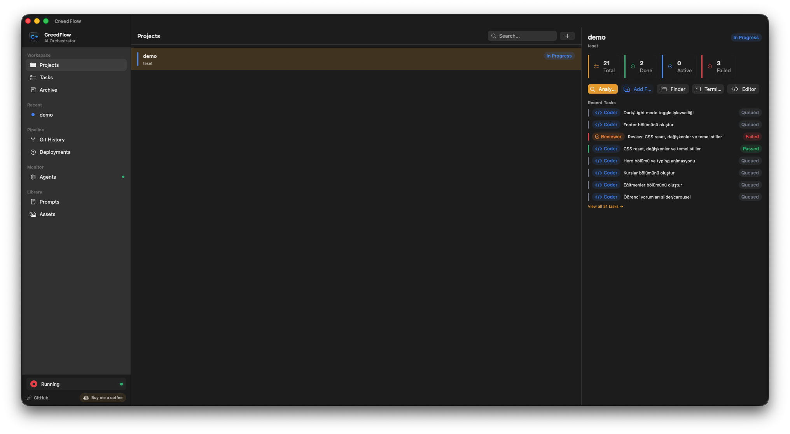
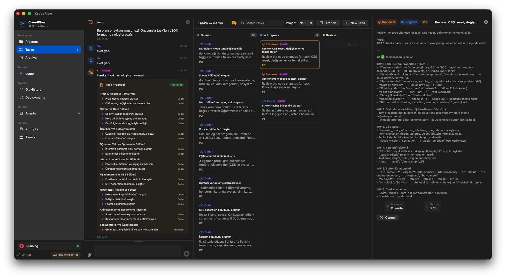
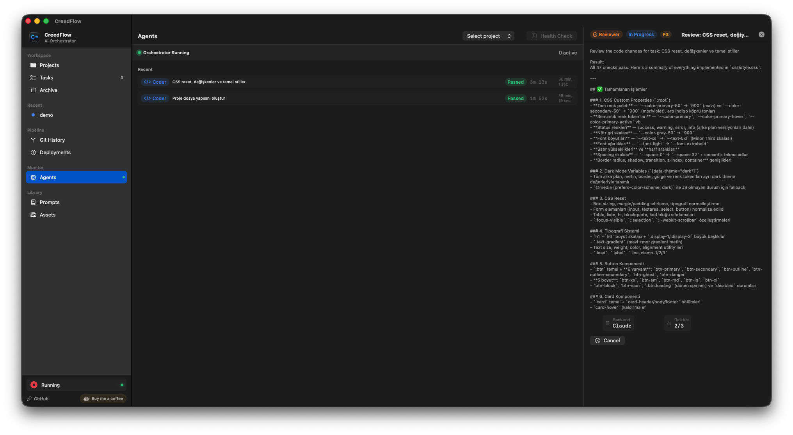
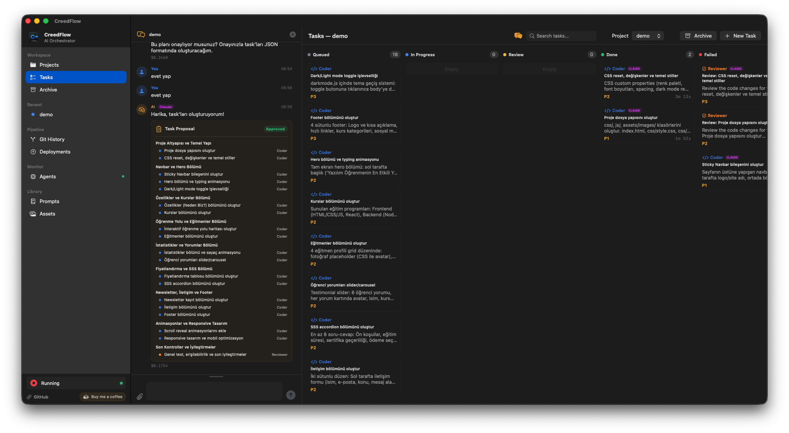
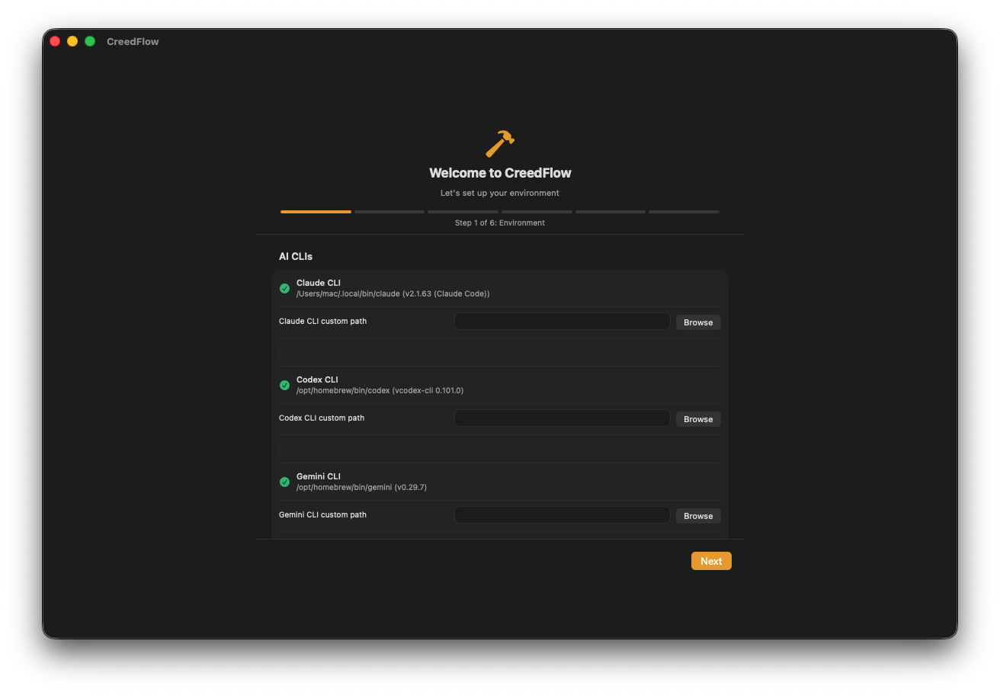
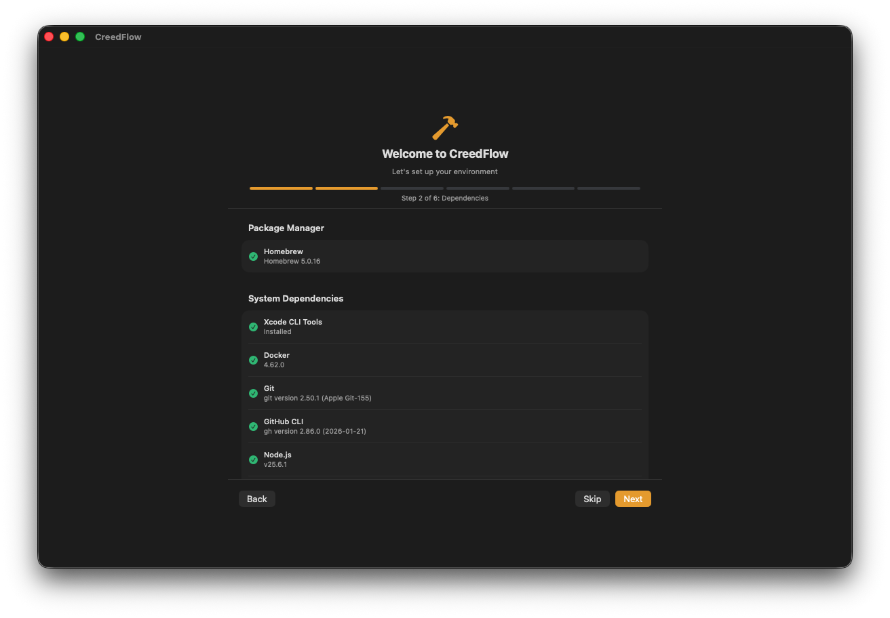
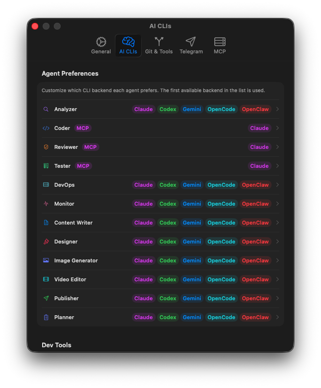
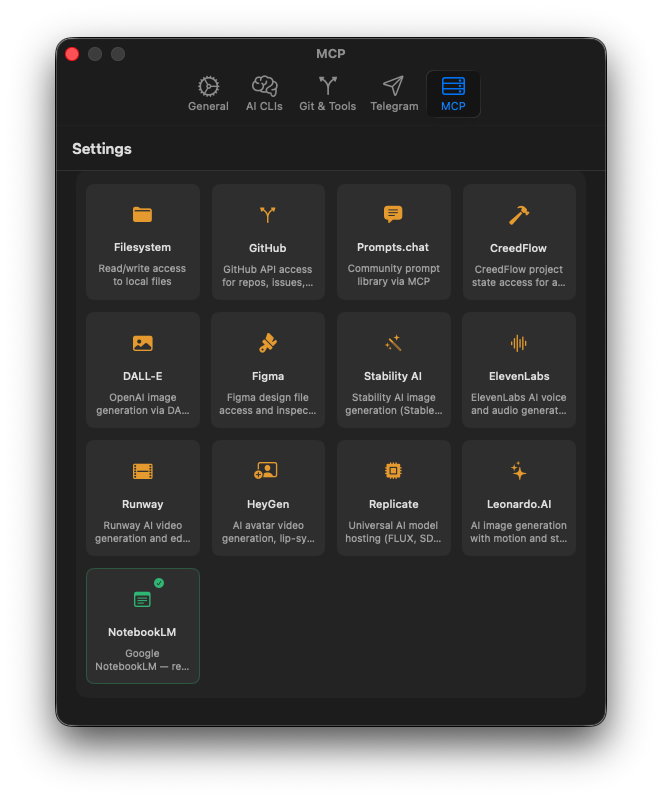

# CreedFlow

**AI-powered project orchestration platform.** Describe a project in natural language — CreedFlow analyzes it, creates tasks, routes them to cloud or local AI backends, reviews code, generates creative assets, publishes content, and deploys.

[](https://github.com/fatihkan/creedflow/releases)
[](https://github.com/fatihkan/creedflow/releases)
[](https://swift.org)
[](https://tauri.app)
[](LICENSE)
[](https://buymeacoffee.com/fatihkan)

---

## Screenshots

| | |
|:---:|:---:|
|  |  |
| **Project Dashboard** — Overview with task stats and quick actions | **Kanban Board** — Tasks grouped by status with live agent output |
|  |  |
| **Agents Working** — Real-time orchestration with backend routing | **Task Details** — Full task list with code review panel |
|  |  |
| **Setup Wizard** — Auto-detect AI CLIs with version info | **Dependencies** — One-click install via Homebrew |
|  |  |
| **Agent Preferences** — Per-agent backend routing config | **MCP Servers** — 13 integrations (DALL-E, Figma, Runway...) |

---

## Download

| Platform | Architecture | Version | Download |
|----------|-------------|---------|----------|
| **macOS** | Apple Silicon (M1/M2/M3/M4) | v1.3.0 | [Download DMG](https://github.com/fatihkan/creedflow/releases/download/v1.3.0/CreedFlow-1.2.0-arm64.dmg) |
| **macOS** | Intel | v1.3.0 | [Download DMG](https://github.com/fatihkan/creedflow/releases/download/v1.3.0/CreedFlow-1.2.0-x86_64.dmg) |
| **Linux** | x86_64 (AppImage) | v1.3.0 | [Download AppImage](https://github.com/fatihkan/creedflow/releases/download/v1.3.0/CreedFlow_1.2.0_amd64.AppImage) |
| **Linux** | x86_64 (Debian/Ubuntu) | v1.3.0 | [Download .deb](https://github.com/fatihkan/creedflow/releases/download/v1.3.0/CreedFlow_1.2.0_amd64.deb) |

> **Requirements:** macOS 14+ or Linux (Ubuntu 22.04+, Debian 12+). At least one AI backend: Claude CLI, Codex CLI, Gemini CLI, OpenCode, OpenClaw, Ollama, LM Studio, llama.cpp, or MLX.

### macOS Installation

Since CreedFlow is not signed with an Apple Developer ID, macOS Gatekeeper will show a warning on first launch:

**Option A — Right-click:**
1. Right-click (or Control-click) on `CreedFlow.app` in Applications
2. Select **Open** from the context menu
3. Click **Open** in the dialog

**Option B — Terminal:**
```bash
xattr -cr /Applications/CreedFlow.app
```

**Option C — System Settings:**
1. Open **System Settings → Privacy & Security**
2. Scroll down to find the CreedFlow blocked message
3. Click **Open Anyway**

This only needs to be done once.

### Linux Installation

**AppImage:**
```bash
chmod +x CreedFlow_1.2.0_amd64.AppImage
./CreedFlow_1.2.0_amd64.AppImage
```

**Debian/Ubuntu:**
```bash
sudo dpkg -i CreedFlow_1.2.0_amd64.deb
```

---

## What's New in v1.4.0

### Phase 1: Core Engine Hardening
- **Backend Health Monitoring** — Periodic health checks for all AI backends with status indicators in Settings
- **Rate Limit Detection** — Automatic detection of rate-limit responses with exponential backoff (60s base, 600s max)
- **MCP Health Monitoring** — Connection health checks for all configured MCP servers every 120s
- **In-App Notification Center** — Toast notifications (top-right, auto-dismiss), bell icon with unread count, notification panel with mark-read/dismiss

### Phase 2: UI Foundation
- **Search & Filter** — Real-time search on all list views: Projects, Tasks, Reviews, Deployments, Agents, Archive
- **Skeleton Loading** — Animated pulse loading states replacing "Loading..." text across all views
- **Dark/Light Mode** — System/Light/Dark theme toggle in Settings (both SwiftUI and Tauri)
- **Keyboard Shortcuts Overlay** — Press `Cmd+?` to see all navigation and action shortcuts
- **Task Duplication** — Right-click any task to duplicate it with all fields copied and status reset to Queued

<details>
<summary><strong>v1.3.0 changes</strong></summary>

#### AI Chat System
- **Project Chat Panel** — Slide-in chat panel for AI-assisted task planning and brainstorming
- **Task Proposals** — AI suggests features and tasks inline; approve or reject with one click
- **Streaming Responses** — Real-time typing indicator with partial content display

#### New Backends: OpenCode & OpenClaw
- **9 AI Backends** — OpenCode and OpenClaw CLI support with auto-detection and smart routing

#### Project Management
- **Import Existing Projects** — Point to an existing directory instead of creating a new one
- **Project Creation Wizard** — Step-by-step guided project setup with tech stack detection
- **Project Docs Export** — Bundle architecture docs, diagrams, and README into a single file
- **Project-Type-Aware Analysis** — Analyzer produces specialized output per project type

#### Prompt System
- **Prompt Import/Export** — Share prompts as JSON files across teams
- **Version Diff** — Side-by-side comparison of prompt versions with line-level diff
- **Prompt Recommender** — AI-powered prompt suggestions based on success rate and review scores

#### Platform
- **CLI Usage Tracking** — Real-time API usage monitoring via Anthropic/OpenAI admin APIs
- **MCP Requirements Checker** — Auto-detect missing MCP servers based on project type
- **Creative AI Services** — HeyGen, Replicate, Leonardo.AI MCP templates
- **Skill Persona** — Assign personality/expertise profiles to tasks
</details>

---

## How It Works

```
You: "Todo app with React + Node.js + SQLite"
  ↓
Analyzer → Architecture docs, ER diagrams, data models, task breakdown
  ↓
Router → Routes tasks to Claude / Codex / Gemini (+ local LLM fallback)
  ↓
Coder → Writes code, opens feature branches per task
  ↓
Reviewer → AI code review with 0-10 scoring
  ↓
Creative agents → Generate images, videos, designs, documents
  ↓
Publisher → Distributes content to Medium, WordPress, Twitter, LinkedIn
  ↓
Telegram notification → You approve → Deploy
```

## Features

- **12 AI Agents** — Analyzer, Planner, Coder, Reviewer, Tester, DevOps, Monitor, ContentWriter, Designer, ImageGenerator, VideoEditor, Publisher
- **Deep Analysis** — Architecture docs, data models with field-level detail, Mermaid diagrams (ER, flowchart, sequence, class), tasks with acceptance criteria and file lists
- **9 AI Backends** — Claude, Codex, Gemini, OpenCode, OpenClaw (cloud) + Ollama, LM Studio, llama.cpp, MLX (local) with smart routing and automatic fallback
- **Backend Health Monitoring** — Periodic health checks with status indicators, rate-limit detection, and exponential backoff
- **In-App Notifications** — Toast notifications, bell icon with unread count, notification panel with mark-read/dismiss
- **Search & Filter** — Real-time search on all list views with consistent search bar component
- **Dark/Light Mode** — System/Light/Dark theme toggle with persistent preference
- **Keyboard Shortcuts** — Full shortcut overlay via `Cmd+?` with navigation and action shortcuts
- **AI Chat** — Project-scoped chat panel for AI-assisted planning with inline task proposals
- **Kanban Board** — Drag-and-drop task management with live agent output and task duplication
- **Project Wizard** — Step-by-step project creation with import existing directory support
- **Setup Wizard** — Environment detection, one-click dependency install via Homebrew (macOS) or apt/dnf/pacman (Linux)
- **Asset Pipeline** — Creative agents produce images/videos/designs with versioning, checksums, and format variants (.md → .html, .txt, .pdf)
- **Content Publishing** — Publish to Medium, WordPress, Twitter, LinkedIn with scheduled publishing
- **Prompt Library** — Versioning, chaining, tagging, import/export, version diff, AI-powered recommendations
- **CLI Usage Tracking** — Real-time API usage monitoring via Anthropic/OpenAI admin APIs
- **Git Integration** — Feature branches, auto-commit, auto-merge on review pass, three-branch progression (dev → staging → main)
- **Local Deploy** — Docker, Docker Compose, or direct process execution
- **MCP Server** — 13 tools + 5 resources via `creedflow://` URIs
- **Creative MCP** — DALL-E, Figma, Stability AI, ElevenLabs, Runway, HeyGen, Replicate, Leonardo.AI integrations
- **Telegram Notifications** — Task completion, review results, deploy status

## Tech Stack

| Component | macOS | Linux |
|-----------|-------|-------|
| Language | Swift 6.0 | Rust + TypeScript |
| UI | SwiftUI | React + Tailwind CSS (Tauri) |
| Database | SQLite via GRDB.swift | SQLite via rusqlite |
| AI Backends | Claude CLI, Codex CLI, Gemini CLI, OpenCode, OpenClaw + Ollama, LM Studio, llama.cpp, MLX | Same |
| MCP | modelcontextprotocol/swift-sdk | — |
| Deployment | Docker / Docker Compose / Direct Process | Same |
| Notifications | Telegram Bot API | Same |

## Build from Source

**macOS (Swift):**
```bash
cd CreedFlow && swift build
.build/debug/CreedFlow

# Package as DMG
./Scripts/package-app.sh --dmg
```

**Linux (Tauri):**
```bash
cd creedflow-desktop
pnpm install
pnpm tauri dev        # Development
pnpm tauri build      # Production (.deb + .AppImage)
```

## Architecture

```
┌─────────────────────────────────────────────────────────────┐
│              Desktop App (SwiftUI / Tauri+React)             │
│  ┌──────────┐  ┌──────────────┐  ┌────────────────────────┐│
│  │ Sidebar   │  │ Task Board   │  │ Detail Panel (Right)   ││
│  │ Projects  │  │ (Kanban)     │  │ Live Output / Review   ││
│  └──────────┘  └──────────────┘  └────────────────────────┘│
└──────────────────────────┬──────────────────────────────────┘
                           │
┌──────────────────────────▼──────────────────────────────────┐
│                    Engine (Orchestrator)                      │
│  ┌─────────────┐  ┌──────────────┐  ┌────────────────────┐ │
│  │ Task Queue   │  │ Backend      │  │ Agent Scheduler    │ │
│  │ (Priority +  │  │ Router       │  │ (Concurrency)      │ │
│  │  Dependencies)│ │ (Smart       │  │                    │ │
│  │              │  │  Fallback)   │  │                    │ │
│  └─────────────┘  └──────────────┘  └────────────────────┘ │
└──────────────────────────┬──────────────────────────────────┘
                           │
┌──────────────────────────▼──────────────────────────────────┐
│                    AI Backends                                │
│                                                              │
│  Cloud:  Claude CLI · Codex CLI · Gemini CLI · OpenCode · OpenClaw │
│  Local:  Ollama  ·  LM Studio  ·  llama.cpp  ·  MLX               │
└──────────────────────────┬──────────────────────────────────┘
                           │
┌──────────────────────────▼──────────────────────────────────┐
│                    12 AI Agents                              │
│                                                              │
│  Analyzer → Planner → Coder → Reviewer → Tester → DevOps   │
│  Monitor → ContentWriter → Designer → ImageGenerator        │
│  VideoEditor → Publisher                                     │
└──────────────────────────┬──────────────────────────────────┘
                           │
┌──────────────────────────▼──────────────────────────────────┐
│                    Storage & Services                         │
│  SQLite (GRDB/rusqlite) · Asset Pipeline · Content Publishing│
│  Telegram Bot · MCP Server · Git Branch Manager             │
└─────────────────────────────────────────────────────────────┘
```

## Agents

| Agent | Backend | Timeout | Purpose |
|-------|---------|---------|---------|
| Analyzer | Any | 5 min | Architecture analysis, data models, diagrams, task decomposition |
| Planner | Any | 5 min | Project planning and task breakdown |
| Coder | Claude preferred | 15 min | Write code, create branches/PRs |
| Reviewer | Claude preferred | 5 min | AI code review with 0-10 scoring |
| Tester | Claude preferred | 10 min | Generate and run tests |
| DevOps | Any | 10 min | Docker, CI/CD, infrastructure setup |
| Monitor | Any | 5 min | Health checks, log analysis |
| ContentWriter | Claude preferred | 10 min | Articles, docs, copy writing + multi-format export |
| Designer | Claude preferred | 10 min | Design specs + Figma access |
| ImageGenerator | Claude preferred | 10 min | AI image generation (DALL-E, Stability) |
| VideoEditor | Claude preferred | 15 min | Video/audio generation (Runway, ElevenLabs) |
| Publisher | Claude preferred | 10 min | Medium, WordPress, Twitter, LinkedIn |

## MCP Server

CreedFlow also runs as an MCP server (`CreedFlowMCPServer` binary):

**Tools (13):** create-project, create-task, update-task-status, get-project-tasks, run-analyzer, get-cost-summary, search-prompts, list-assets, get-asset, list-asset-versions, approve-asset, list-publications, list-publishing-channels

**Resources (5):** `creedflow://projects`, `creedflow://tasks/queue`, `creedflow://costs/summary`, `creedflow://projects/{id}/assets`, `creedflow://publications`

## Security

CreedFlow orchestrates AI agents that generate and modify code autonomously. When using AI-powered code generation, follow these security practices:

- **Review all AI-generated code** before committing or deploying. AI agents can produce code with unintended vulnerabilities.
- **Never commit secrets** — API keys, tokens, passwords, and private keys should never be stored in your repository. Use environment variables or a secrets manager.
- **Use `.gitignore`** — Ensure `.env`, `*.pem`, `*.key`, and other sensitive file patterns are excluded from version control.
- **Sandbox your deployments** — CreedFlow supports Docker-based deployment. Use containers to isolate AI-generated code from your host system.
- **Monitor agent output** — Review agent logs and generated files before approving tasks, especially for DevOps and deployment operations.
- **Keep backends updated** — Regularly update your AI CLI tools (Claude, Codex, Gemini, etc.) to get the latest security patches.

> CreedFlow stores API keys and tokens locally on your machine (UserDefaults on macOS, settings.json on Linux). These are never transmitted to third parties beyond the configured AI backends.

## Support

If you find CreedFlow useful, consider supporting the project:

[](https://buymeacoffee.com/fatihkan)

## License

[MIT](LICENSE) — Copyright (c) 2025 Fatih Kan
